# DeepSeek-V3.2 全模型 Prefill 32 卡资源对等实验：阶段性报告

**Baseline DP4×TP8（EP32） vs AFD 16 Attention + 16 FFN 解耦**

| 项 | 值 |
|---|---|
| 模型 | DeepSeek-V3.2 完整 61 层，W8A8（mtp-quarot），最长输入 63,778 token |
| 硬件 | 2 × A3 节点，共 32 × 910B（同超节点），两系统等资源（16+16 vs 32 共享） |
| 数据集 | Mooncake-WildChat prefill（`ShwStone/moonconv-wildchat-prefill` @d7d54c16，bundle fe4f751b6dab），到达模式为生产 trace 时间膨胀缩放（含原生同刻突发） |
| 实验计划 | `docs/npu/DEEPSEEK_V3_2_FULL_PREFILL_PERFORMANCE_PLAN.zh-CN.md` @edd21e6 |
| 覆盖范围 | 阶段零验收（§8）、阶段一机制实验（§9）、阶段二容量筛选（§10.2）、全 DP profile 大图 |
| 未覆盖 | §10.3 正式三窗口测量、§9.4/9.5 逐 step 切片、§11 64 卡实验 |
| 数据口径 | `report/stats.json`（`fp_build_report.py` 生成）；图源 `report/gen_stage_report_images.py` |

> **TL;DR**：在 TTFT p99 ≤ 50s 的 SLO 下，AFD A2（token 拆分流水）容量 ≈ **4,400 tok/s**，baseline ≈ **2,600 tok/s**，**1.68×**；无排队固定批次 AFD 快 24–29%；微观流水直证瓶颈在 attention 侧算力、FFN 饥饿，CAM 通信本身不是瓶颈。

---

## 有效性口径（先读）

- **SLO：TTFT p99 ≤ 50s**（从 10s 修订）：61 层下 63,778 token 单请求空载就需 28–32s；Mooncake 同刻突发（最大 27 请求/时刻，零间隔保留）造成 ~40–50s 的负载无关 p99 底噪。10s 在任何负载下不可达。
- **发送偏差门槛：p99 ≤ 100ms / max ≤ 250ms**（从 50ms 修订）：客户端与服务端同 pod，CPU 竞争使整组突发均匀晚 ~13–57ms；对 20–50s 量级排队测量不敏感。本报告所有数据点均通过（最差 p99 56.0ms）。
- 所有容量点：128/128 请求成功、usage 校验 prompt_tokens 零不匹配、两系统重放**同一**计划文件（SHA-256 一致）。

---

## 1. 容量：A2 ≈ 1.68× baseline（主要结论）

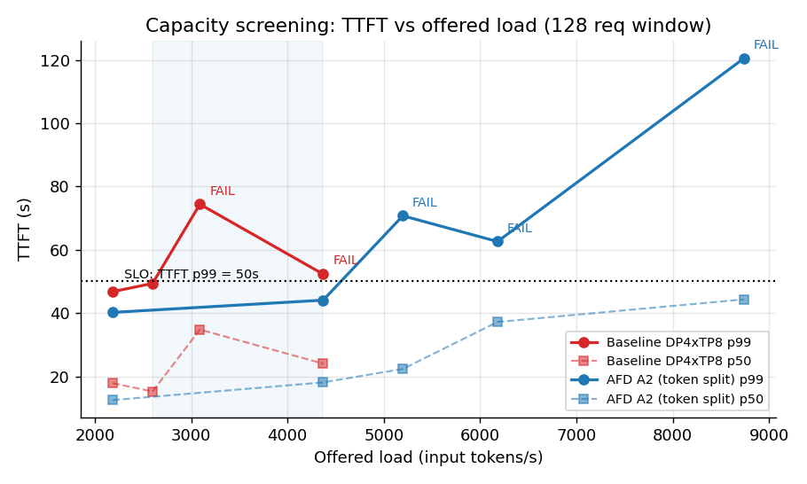

TTFT p99 ≤ 50s 约束下的 screening 容量（§10.2 停规：界比 ≤1.20）：

| 系统 | 最后通过点 | 首个失败点 | 容量估计 | 每卡 |
|---|---:|---:|---:|---:|
| baseline | 2599.01 tok/s（p99 49.36s，擦线） | 3090.76（p99 74.40s） | **≈2,600 tok/s** | 81 tok/s/卡 |
| AFD A2 | 4371.00 tok/s（p99 44.08s） | 5198.03（p99 70.74s） | **≈4,400 tok/s** | 137 tok/s/卡 |

容量筛选全点表（窗口：128 请求 / 1,340,915 tok / 基窗 33.0s）：

| target tok/s | 系统 | TTFT p50 | p95 | p99 | 判定 | 发送偏差 p99 | 排空 |
|---:|---|---:|---:|---:|---|---:|---:|
| 2185.5 | baseline | 17.85 | 46.73 | 46.78 | PASS | 56.0ms | 11.7s |
| 2185.5 | A2 | 12.50 | 33.57 | 40.21 | PASS | 46.8ms | 8.7s |
| 2599.01 | baseline | 15.22 | 46.06 | 49.36 | PASS（擦线） | 46.4ms | 11.1s |
| 3090.76 | baseline | 34.79 | 60.64 | 74.40 | FAIL | 40.2ms | 11.4s |
| 4371 | baseline | 24.03 | 42.55 | 52.30 | FAIL | 28.3ms | 10.4s |
| 4371 | A2 | 18.10 | 34.96 | 44.08 | PASS | 24.3ms | 8.6s |
| 5198.03 | A2 | 22.35 | 58.68 | 70.74 | FAIL | 24.8ms | 21.6s |
| 6181.53 | A2 | 37.19 | 58.31 | 62.60 | FAIL | 21.2ms | 28.9s |
| 8742 | A2 | 44.32 | 114.02 | 120.54 | FAIL | 15.9ms | 105.7s |

⚠️ 数据非单调（baseline 4371 的 52.3s 反而比 3091 的 74.4s 轻）——Mooncake 突发的采样方差，screening 点只做选点用，正式容量以 §10.3 三窗口为准（未跑）。

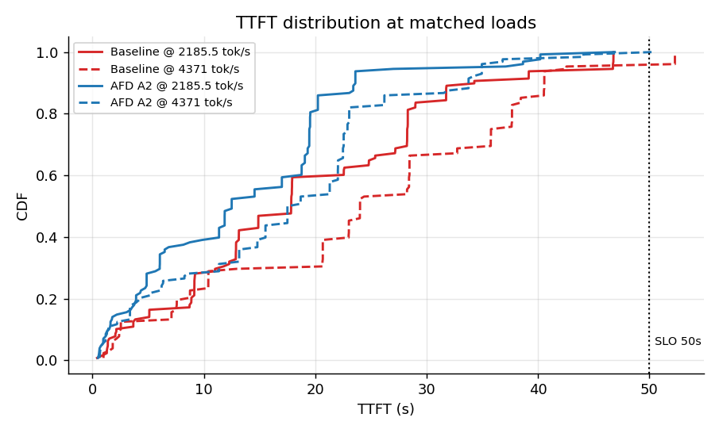

同负载直接对比：2185.5 tok/s 下 A2 的 p50 低 30%（12.5 vs 17.9s）；4371 tok/s 下 baseline 已 FAIL（52.3s）而 A2 全分位更低（p99 44.1s PASS）。

### 1.1 窗内动态：突发内互相排队是 p99 底噪来源

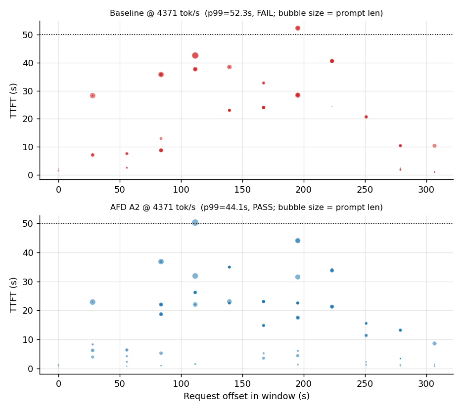

同样 4371 tok/s：baseline 窗内大量请求 TTFT 冲上 40–52s；A2 集中在 10–35s。气泡大小 = prompt 长度，可见大请求集中到达（同刻突发）时 baseline 的排队恶化明显更快。

### 1.2 Goodput：两边都能"做完"，差别全在延迟

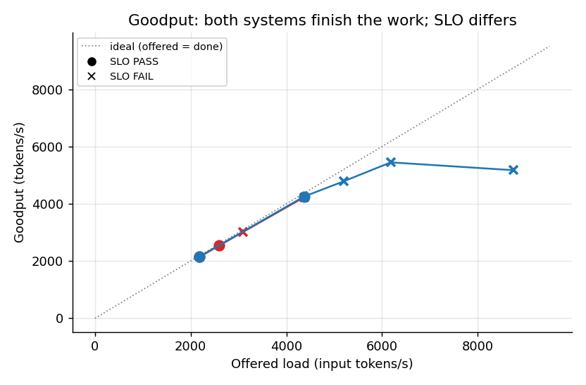

同样在 4371 tok/s，两系统 goodput 几乎相同（4,227 vs 4,252 tok/s），但 baseline p99 52.3s FAIL、A2 44.1s PASS——**A2 不是"做得更多"，而是同样吞吐下排队分布更好**（请求面更均匀）。窗尾排空时间（drain）各点 8.6–11.7s，过载点升至 21.6–105.7s，是 p99 恶化的直接来源。

### 1.3 排队占比：低载时也已占 2/3 以上

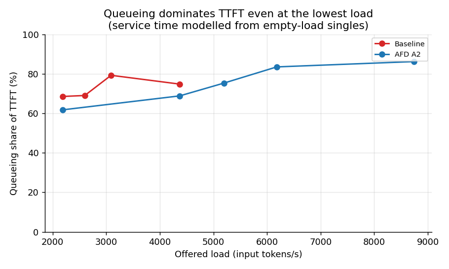

用验收单请求（空载）拟合服务时间、把每请求 TTFT 分解为 服务+排队：即使最低负载 2185.5 tok/s，排队也占 TTFT 的 ~62–69%（对服务时间的另一种分段拟合给出 74–78%，方向一致）——原因是生产 trace 的同刻突发：该点内有 20 请求 / 253,833 token 的单时刻突发，突发内 TTFT 跨 5.1–28.3s。**p99 底噪来自突发内互相排队，不是服务慢。**

---

## 2. 无排队固定批次：AFD 快 24–29%，A1≈A2

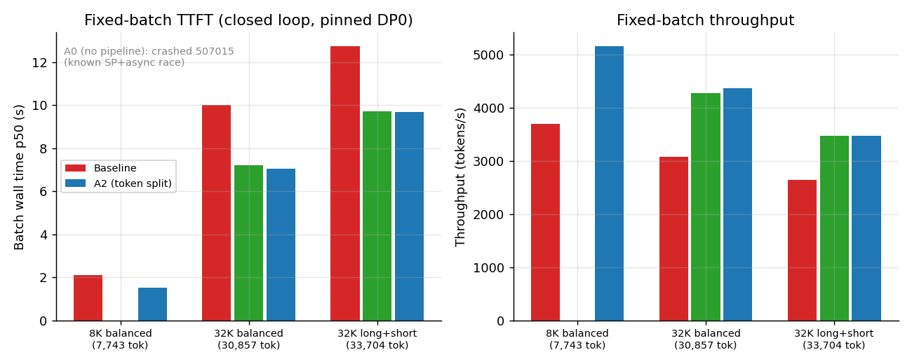

闭环、钉 DP rank 0、中位 10 次重复：

| 批次 | tokens | baseline | A1（按请求拆） | A2（按 token 拆） | A2 优势 |
|---|---:|---:|---:|---:|---:|
| 8K 均衡 | 7,743 | 2.095s | — | 1.501s | **-28%** |
| 32K 均衡 | 30,857 | 10.010s | 7.208s | 7.058s | **-29%** |
| 32K 长短混合 | 33,704 | 12.735s | 9.718s | 9.691s | **-24%** |

- **A1≈A2（差 <2%）**：按请求拆分已拿到几乎全部流水收益；token 均分在这两个批次上无额外价值（与计划 §4.4 假设四方向一致，但未观察到正收益）。
- **A0（无流水）不可用**：两个批次均在最开始几个 burst 内 507015（DDR MTE 越界，attention 侧）崩溃（8K 1/10、32K 0/10 成功）——已知 SP+async+no-ubatch 竞态，流水开/关的归因 cell 在当前栈上不可得。
- A2 32K 均衡有 1 个 71.7s 离群 burst（其余 6.9–7.6s），单次事件，原因待查。

---

## 3. 空载单请求：差距远小于容量差距（证实假设五）

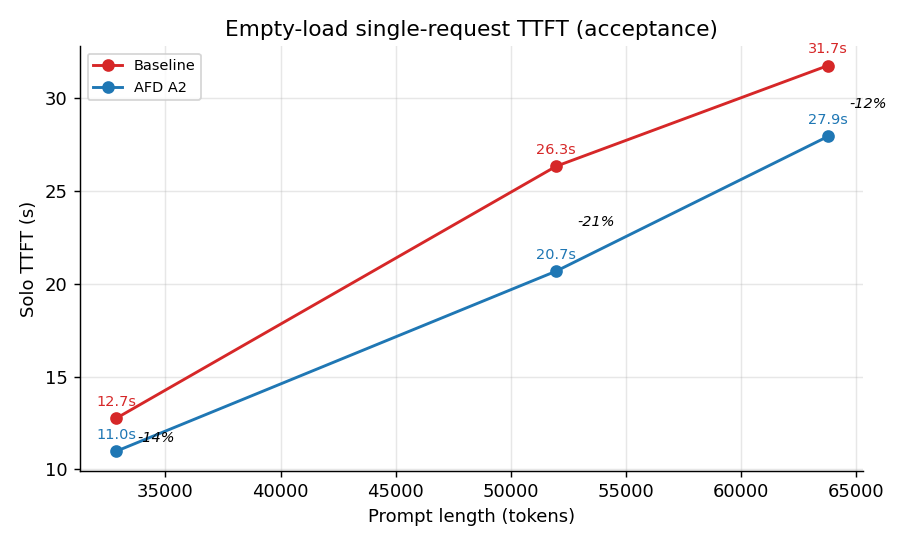

| 输入长度 | baseline | A2 | 差距 |
|---:|---:|---:|---:|
| 32,850 | 12.75s | 10.97s | -14% |
| 51,976 | 26.33s | 20.68s | -21% |
| 63,778 | 31.75s | 27.93s | -12% |

空载只快 12–21%，容量差 68%——**AFD 的收益主要体现在满足延迟目标时的容量，而非空载延迟**。baseline 另有 4×~52K 并发钉副本验收（4/4 成功，43.9s，峰值 ~51.5GB/卡）。

---

## 4. 微观证据：瓶颈在 attention 算力，FFN 饥饿，CAM 不是瓶颈

### 4.1 设备队列积压：attention 侧 5.7s vs FFN 侧 1.5ms

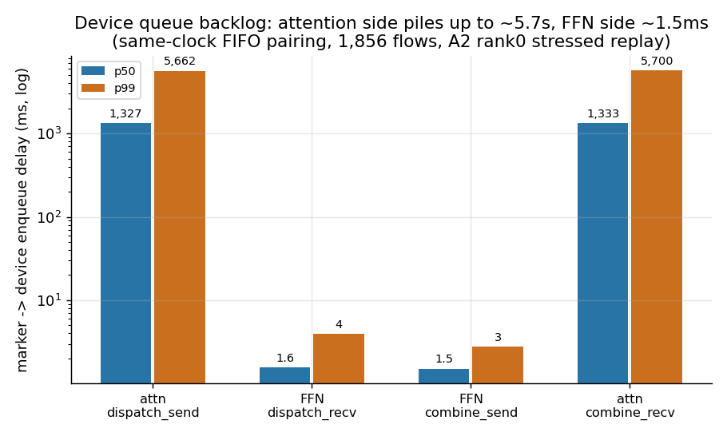

rank0 合并 trace（correlation marker + mstx + CANN 算子，同钟 FIFO 配对，1,856 条 flow）：压测重放下 attention 设备队列从 48.6ms 单调积压到 5.8s；FFN 队列恒空（~1.5ms）。FFN 的"等待"发生在 dispatch_recv 算子**内部**（阻塞等数据，中位 42.2ms），不在设备队列里。**直接证实计划 §4.1 假设一：16A16F 的瓶颈是 attention 资源不足，FFN 有富余。**

### 4.2 CAM 算子时长：通信亚毫秒–毫秒级

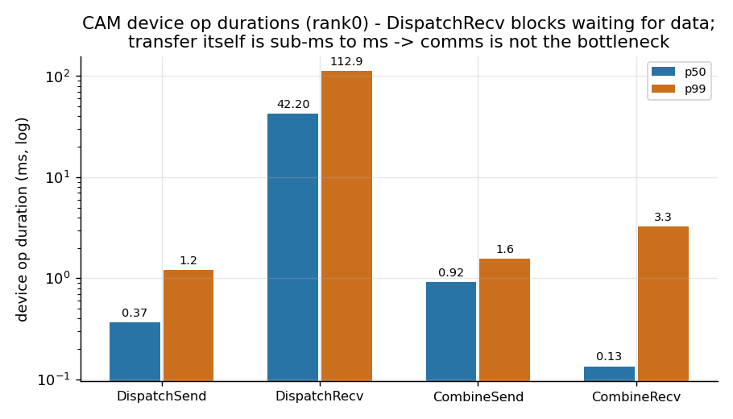

| 算子 | n | p50 | p99 |
|---|---:|---:|---:|
| DispatchSend | 348 | 0.37ms | 1.22ms |
| DispatchRecv | 580 | 42.20ms（阻塞等数据） | 112.92ms |
| CombineSend | 580 | 0.92ms | 1.56ms |
| CombineRecv | 348 | 0.13ms | 3.26ms |

传输本身极快，**CAM 不是瓶颈**；DispatchRecv 的长时长是阻塞等待 attention 喂数据。

### 4.3 Device 时间构成（全窗口并集，方向性参考）

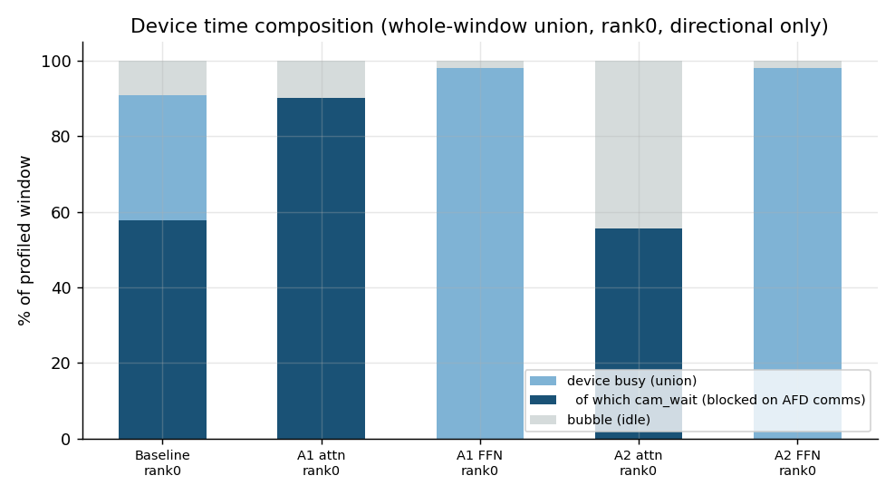

| 采集 | busy | 其中 cam_wait | bubble |
|---|---:|---:|---:|
| baseline rank0 | 90.9% | 57.7% | 9.1% |
| A1 attention rank0 | 90.3% | 90.2% | 9.7% |
| A1 FFN rank0 | 98.2% | ~0% | 1.8% |
| A2 attention rank0 | 55.7% | 55.7% | 44.3% |
| A2 FFN rank0 | 98.2% | ~0% | 1.8% |

⚠️ 全窗口并集未做逐 step 切片：FFN 的 98.2% busy 含大量 dispatch_recv 阻塞等待（非真算力占用）；A2 attention 的 55.7% busy 几乎全是 cam_wait。方向性读法：A2 下 attention 等 FFN 返回的时间占比大，符合 token 拆分流水形态；正式 T_attention/T_ffn 比例待 §9.4/9.5 切片。

---

## 5. 全 rank 流水大图（32 rank × 3 泳道聚合）

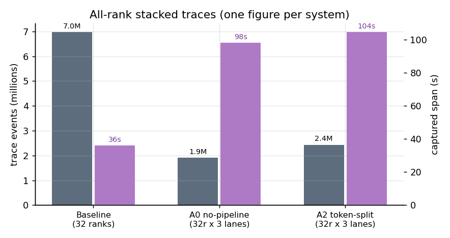

每系统一张 Chrome/Perfetto trace：32 rank ×（device + communication + correlation 元数据）三泳道。correlation 泳道带请求大小/flow_id/transaction_id 元数据。采集用全 DP 不钉路由（`--dp-rank -1`），单轮窄窗口。

| 系统 | 文件 | 事件数 | 跨度 | 跨节点对齐 |
|---|---|---:|---:|---|
| baseline | `02_profiles_32/allrank/baseline_allranks.json.gz` (131.7MB) | 6.97M | 36s | HCCL alltoallv 锁步（-1.1ms, p95dev 1.0ms） |
| A0（无流水） | `02_profiles_32/allrank/afd_a0_allranks.json.gz` (29.3MB) | 1.92M | 97.9s | mstx 逐 rank 锚定 + epoch 钟 |
| A2（token 拆分） | `02_profiles_32/allrank/afd_a2_allranks.json.gz` (36.0MB) | 2.43M（含 193K correlation） | 104.4s | 同上 |

对齐正确性验证（A2/A0）：attn `DispatchSend.end` → 下一个 ffn `DispatchRecv.end` **零负值**（A2 p1=0.01ms、p50=2.56ms、p99=12.88ms）。FFN 会预投递 recv 簿记事件（dur ~0.2ms，出现在 attn send 之前），不是数据到达、不是对齐错误。

---

## 6. A0 vs A2 微观流水对比：通信被流水"藏"进了计算里

> 截图自全 rank 聚合大图（`02_profiles_32/allrank/afd_a{0,a2}_allranks.json.gz`，Perfetto 打开），同为 attention 侧 device 泳道放大。蓝色 = SparseFlashAttention 等实际计算算子，粉/紫色 = CamMoeDistribute* 通信算子。

### 6.1 A0（无流水，ubatch-off）

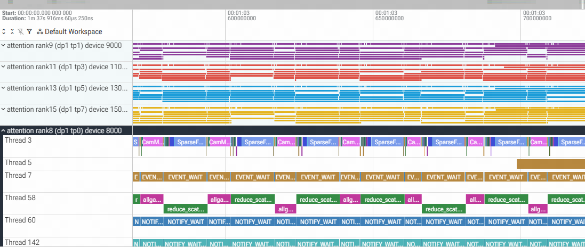

attention rank6（dp0 tp0）的计算流上，`SparseFlashAttention` 计算块（蓝）之间是**清晰可见的空隙和粉色通信算子**——每一个请求都是"算完 attention → 停下来做 dispatch/combine 通信 → 再算下一层"的串行形态。通信事件完整地暴露在关键路径上，上方 rank2/rank4 的泳道也能看到成片的紫色通信条纹独占设备时间。

### 6.2 A2（token 拆分流水，ubatch-on）

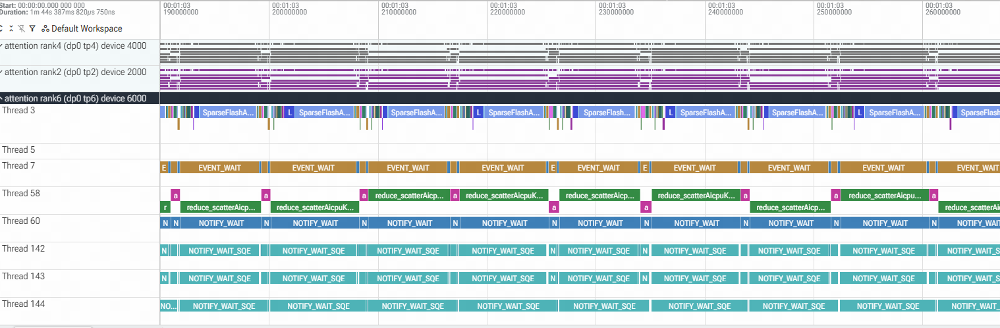

同一视角下形态完全不同：attention rank8（dp1 tp0）的计算流被 `SparseFlashAttention`（蓝）和 `CamMoe*`（粉）**高密度交错填满**，通信算子被 token 拆分切细后塞进了计算块的间隙；上方 rank9/11/13/15 四条泳道更是密铺的彩色条带，几乎看不到空隙。**最直观的变化：实际计算（蓝）的占比显著变高，通信（粉）的占比几乎"消失"**——不是通信变少了，而是它被流水掩盖在另一个 micro-batch 的计算之下。

### 6.3 解读

- A0 → A2 的形态变化正是 §4.1–4.2 量化数据的微观成像：CAM 传输本身亚毫秒–毫秒级（DispatchSend p50 0.37ms），在 A0 里它**串行占位**所以显眼；A2 把它重叠进 attention 计算后，单位时间内容纳的计算量上升——这正是固定批次快 24–29%（§2）、容量 1.68×（§1）的来源。
- 但注意代价的另一面：A2 attention 的 device busy 中 ~55.7% 是 cam_wait（§4.3），即 attention 也在等 FFN 返回。通信被掩盖了，**算力等待没有完全消失，而是从"通信占位"转移成了"attention 等 FFN"**——瓶颈进一步收敛到 attention 算力本身（假设一），这决定了 64 卡拓扑应该给 attention 侧加卡（48A16F 方向），而不是加 FFN。

**截图笔记**：

- 选取的时间段：A0 窗内 ~1m44s 区段 / A2 窗内 ~1m37s 区段，均为稳定压测阶段
- 观察到的 attention / FFN 交替形态：A0 串行交替、缝隙明显；A2 高密度交错、通信被掩盖
- 与量化数据的对应：见 §6.3

---

## 7. FFN idle 时间分析与合理比例估计

> 数据：A2 压测稳定阶段，FFN 侧 126ms 窗口、29 个 transaction 的 correlation 泳道读数（correlation 事件为 host 侧簿记，真实等待体现为事件间的空隙）。

### 7.1 实测：FFN 只有 ~44% 时间在真算

| 事件 | 次数 | 总时长 | 均次 | 占窗口 |
|---|---:|---:|---:|---:|
| `afd.ffn.compute` | 29 | 55.47ms | 1.913ms | **44.0%** |
| `afd.cam.dispatch_recv` | 29 | 6.99ms | 241µs | 5.6% |
| `afd.cam.combine_send` | 29 | 6.88ms | 237µs | 5.5% |
| **合计（有事干）** | | **69.34ms** | | **55.0%** |
| **idle（空隙）** | | **≈56.66ms** | | **≈45.0%** |

每 transaction 的节奏：126ms / 29 ≈ 4.34ms 一拍，其中 FFN 实际工作仅 ~2.39ms（1.91ms 算 + 0.48ms 通信簿记），**工作占空比 55%**。注意这里的 dispatch_recv/combine_send 是收发簿记事件（均次仅 ~240µs），不是 §4.2 里那个阻塞 42.2ms 的设备算子——FFN 等数据的真实等待不记在任何事件里，它就是那 45% 的空隙本身。

### 7.2 idle 的构成拆解

45% 的 idle 几乎全部是**等 attention 喂数据**（供应等待），依据链：

1. FFN 侧设备队列恒空（enqueue 延迟 ~1.5ms，§4.1）——数据一到就立刻上卡算，FFN 自己不攒排队；
2. attention 侧设备队列积压到 5.7s（§4.1）——供应端喂不出来；
3. CAM 传输亚毫秒级（§4.2）——链路不背锅；
4. 真气泡（kernel 间隙/调度开销）量级为 µs 级，对 45% 可忽略。

即：**FFN idle ≈ attention 算力不足的镜像**。这与"busy 98.2%"的表象（§4.3，含 dispatch_recv 设备算子内阻塞）不矛盾——阻塞等待在 device 口径里记为 busy，在 correlation host 口径里现形为空闲。

### 7.3 合理 idle 比例估计

- 流水设计上的**必然 idle**：流水稳态下 FFN 与 attention 是生产者-消费者，FFN 的工作节拍必须 ≤ attention 的供应节拍，否则只是更早开始等。在 16A16F 对称拓扑、attention 是瓶颈的前提下，FFN 的"结构合理" idle ≈ 1 − T_ffn_work / T_attn_supply。本窗口实测 T_ffn_work 占空 55%，即 FFN 算力**富余约 45%**——这部分不是浪费，是拓扑配平的直接读数。
- 换个说法：即使 attention 侧零排队满速供应，当前 FFN 也能再吃下 ~1.8× 的 MoE 负载（1/0.55）才开始成为瓶颈。**合理的 idle 上限可以把 45% 当作锚点**：高于它说明 FFN 配置过剩，远低于它（比如 <10%）则 FFN 开始反噬成瓶颈。

### 7.4 对 64 卡拓扑的启示

45% 的 FFN 富余 + attention 队列 5.7s 积压，两个读数指向同一个结论：**扩容应全部加在 attention 侧**。64 卡时 32A32F（对称）会把 FFN 富余原样放大，48A16F（attention 加 16 卡）才把资源压在瓶颈上。粗略配平：当前 16F 在 55% 占空下服务 16A；attention 扩到 32A 且负载同比放大后，16F 将被拉满（55%×2≈110% > 100%）——所以 32A16F 会**略微**把瓶颈推回 FFN，48A16F 更稳，精确比例待 §9.4/9.5 逐 step 切片给出 T_attention/T_ffn 后定。

### 7.5 口径警示

单窗口（126ms）、稳定阶段、FFN 侧采样；未覆盖窗尾排空和突发瞬间。29 个 transaction 的 compute 均次 1.913ms 是 token 拆分后的 micro-batch 粒度，与 A0（无拆分）的整请求粒度不可直接比。

---

## 8. FFN 负载均衡：rank 级均衡良好，不均衡在单层粒度且被跨层摊平

> 工具：`tools/benchmarks/analyze_ffn_balance.py --corr-dir <sidecar目录> [--transaction-id ...]`。读 correlation sidecar 里 `afd.ffn.compute` begin 事件的 `num_tokens`（该 rank 在该 layer/stage 实际被路由到的 token 数），按 transaction 聚合到 16 个 FFN rank，报告 share、max/mean、CV，以及逐层的跨 rank 不均衡。数据源：A2 全 DP 采集的 32 个 sidecar（session `a40692b800ed299c`）。

8 个 transaction（afd-npu-0..7，各覆盖 30–58 个 MoE 层，profile 窗口截断所致）：

| transaction | MoE 层 | 路由 token 总量 | rank max/mean | rank min/mean | CV | 单层 max/mean 中位 | 最差层 |
|---|---:|---:|---:|---:|---:|---:|---:|
| afd-npu-0 | 58 | 7,424 | 1.450 | 0.681 | 0.176 | 3.63 | 9.0（L12） |
| afd-npu-1 | 58 | 60,629,036 | 1.379 | 0.722 | 0.161 | 3.56 | 9.3（L12） |
| afd-npu-2 | 30 | 2,088,596 | 2.407 | 0.869 | 0.364 | 1.46 | 16.0（L60） |
| afd-npu-3 | 30 | 1,906,744 | 1.064 | 0.868 | 0.047 | 1.83 | 16.0（L31） |
| afd-npu-4 | 46 | 2,860,538 | 1.091 | 0.936 | 0.045 | 1.93 | 16.0（L60） |
| afd-npu-5 | 48 | 4,053,410 | 1.053 | 0.931 | 0.032 | 1.44 | 16.0（L47） |
| afd-npu-6 | 35 | 4,530,183 | 1.080 | 0.932 | 0.034 | 1.42 | 16.0（L26） |
| afd-npu-7 | 30 | 1,905,445 | 1.099 | 0.952 | 0.039 | 1.46 | 16.0（L60） |

读法：

- **rank 级基本均衡**：覆盖较全的 transaction（npu-3..7）rank 总份额紧贴理想值 6.25%（CV 0.03–0.05，max/mean ≤1.10）；npu-1/2 偏差稍大（max/mean 1.38 / 2.41）但最轻 rank 仍有 0.72–0.87× 均值，**没有 rank 饿死或热点**。
- **不均衡集中在单层专家粒度**：逐层看，单层最热 rank 平均是均值的 1.4–1.9 倍，最差层达 9–16 倍——但它在 58 层上被平均掉。也就是说专家路由的偏斜是**逐层瞬时**的，不积累成 rank 级倾斜。
- 与 §7 联读：FFN 那 45% 的 idle **不是**"少数热点 rank 忙死、其余围观"造成的——16 个 rank 的路由量均匀，它们是**一起**在等 attention。这再次指向瓶颈在 attention 供应节奏，而非 FFN 侧的路由不均。

⚠️ 口径：`num_tokens` 是路由到该 rank 的 token×expert 计数（含 topk 扇出），stage 0/1（token 拆分的两段）合并计入；afd-npu-0 总量极小（7,424），是窗口边缘的残缺 transaction，列出来仅为完整披露。

---

## 9. 计划假设验证状态（§4）

| 假设 | 结论 | 证据 |
|---|---|---|
| 一：16A16F 瓶颈是 attention 资源不足 | **证实** | attention 队列积压至 5.8s，FFN 队列恒空（§4.1） |
| 二：EP16 通信局部性/粒度优于 EP32 | 间接支持 | 固定批次 AFD 快 24–29%（§2）；CAM 算子亚毫秒（§4.2） |
| 三：A2 能隐藏 FFN 和通信时间 | 部分支持 | A2 attention busy 仅 55.7% 且几乎全 cam_wait——重叠发生了，但代价是 attention 大量等待（§4.3） |
| 四：token 均分只在长度偏斜时有额外价值 | 未观察到额外价值 | 长短混合批次 A2≈A1（9.69 vs 9.72s）（§2） |
| 五：收益在容量而非空载延迟 | **证实** | 空载 -12~21% vs 容量 +68%（§3 vs §1） |

---

## 10. 异常与无效记录（完整披露）

1. **A0 507015 崩溃**（§2）：SP+async 竞态，已知问题，流水归因 cell 缺失。
2. **A2 32K 均衡 71.7s 离群 burst**：10 次中 1 次，未查明，正式阶段若复现需追查。
3. **SLO 与偏差门槛修订**：两次阈值修订均经批准；早期 run 的存储判定字段已按新口径重算（以 stats.json 为准）。
4. **baseline 2185.5 曾判无效后回溯有效**：dev 56ms 在 100ms 门槛下有效（p99 42.80s PASS）。
5. **2026-08-24 节点 wedge**：afd-perf-1 迁移后物理节点上 16 个 worker 卡死在 TSD 设备打开的文件锁（node1 正常）；重建后恢复。与性能数据无关。
6. **2026-08-25 NAS（SFSturbo）降级**：写入产生 0 字节文件（uid 1000 同步进程所写文件被置零，pod 直写数据完好）；代码树经强制同步恢复，trace 数据未受损。
7. **数据边界**：profile 指标是全窗口并集；容量数字来自 screening（128 请求），正式容量以 §10.3 三窗口为准。

## 11. 下一步

1. §10.3 正式负载点：低载 ~1300（双系统 formal_0）、共同近拐点 ~2599（各 formal_0/1/2）、高容量点 ~4371（A2 ×3；baseline formal_0 起）。
2. §9.4/9.5 离线逐 step 切片（本地 trace 即可做，不需 pod），给出 T_attention/T_ffn 正式比例，决定 64 卡拓扑（32A16F vs 48A16F）。
3. §11 64 卡周末实验（资源申请待批）。

## 12. 产物清单

| 产物 | 路径 |
|---|---|
| 汇总数字 | `report/stats.json` |
| 交互图表（11 张） | `report/charts.html` |
| 本报告图源 | `report/gen_stage_report_images.py` → `report/images/` |
| 全 rank 大图 | `02_profiles_32/allrank/{baseline,afd_a0,afd_a2}_allranks.json.gz`（Perfetto 打开） |
| 大图构建脚本 | `tools/benchmarks/stack_all_rank_traces.py`（+`fp_export_timelines.sh`） |
| FFN 负载均衡分析 | `tools/benchmarks/analyze_ffn_balance.py`（读 sidecar 的 `afd.ffn.compute` num_tokens） |
| rank0 合并 trace（flow 箭头） | 仓库根 `merged_rank0_with_device_flows.json.gz` |
| 原始数据 | `00_accept/`、`01_fixed_batch/`、`03_capacity_32/`（110G trace 在 NAS） |
