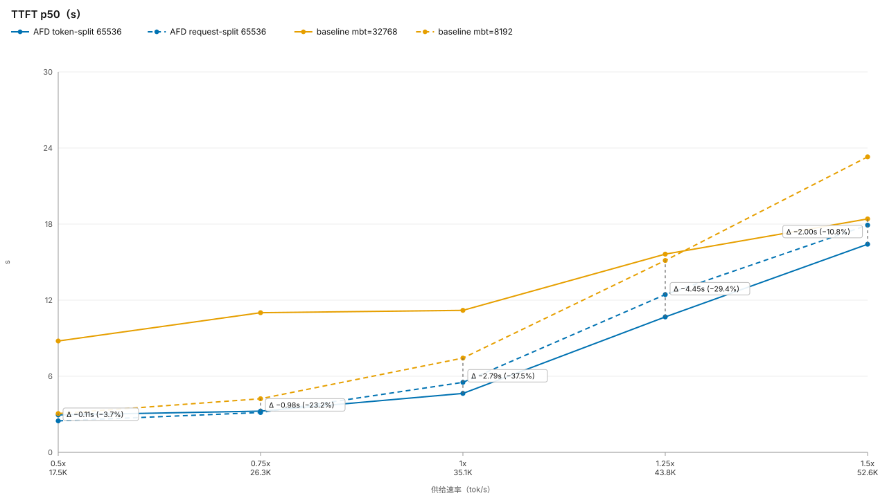
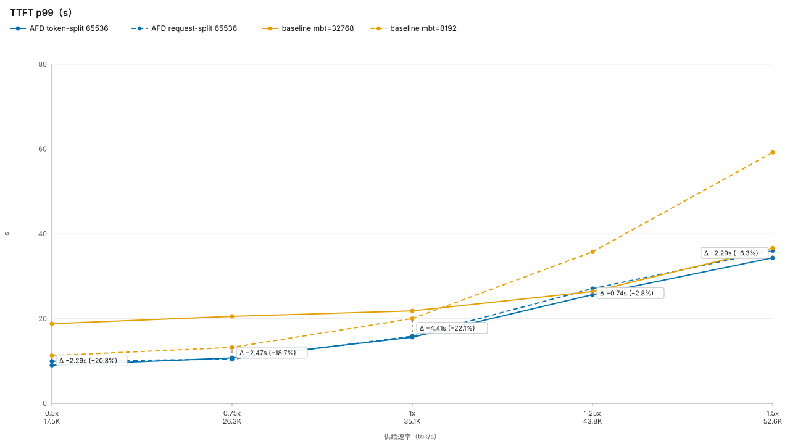
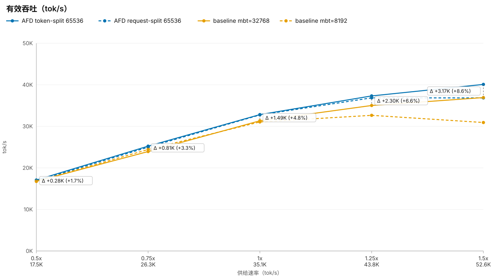
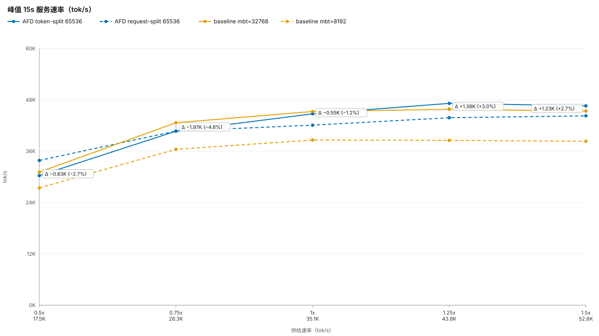
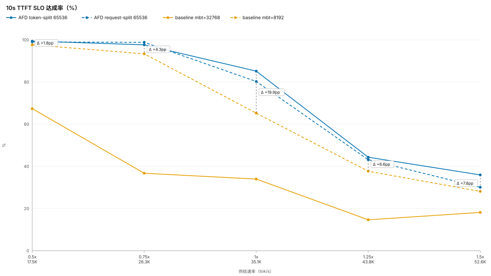
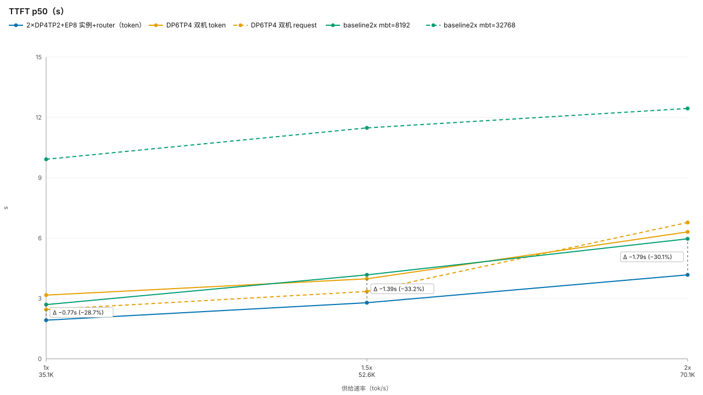
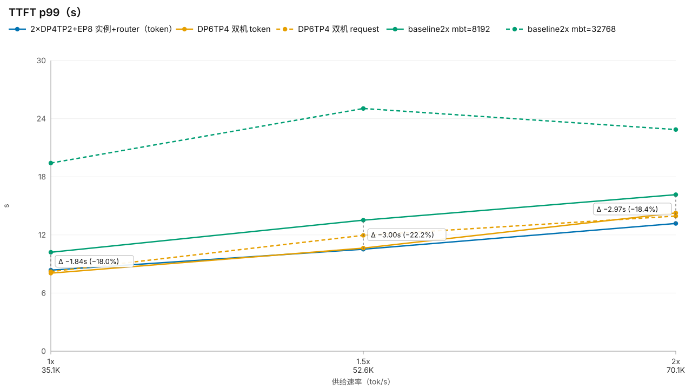
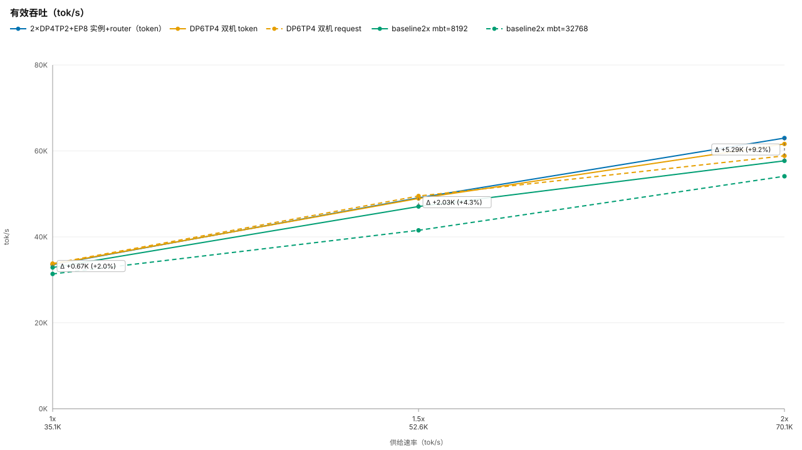
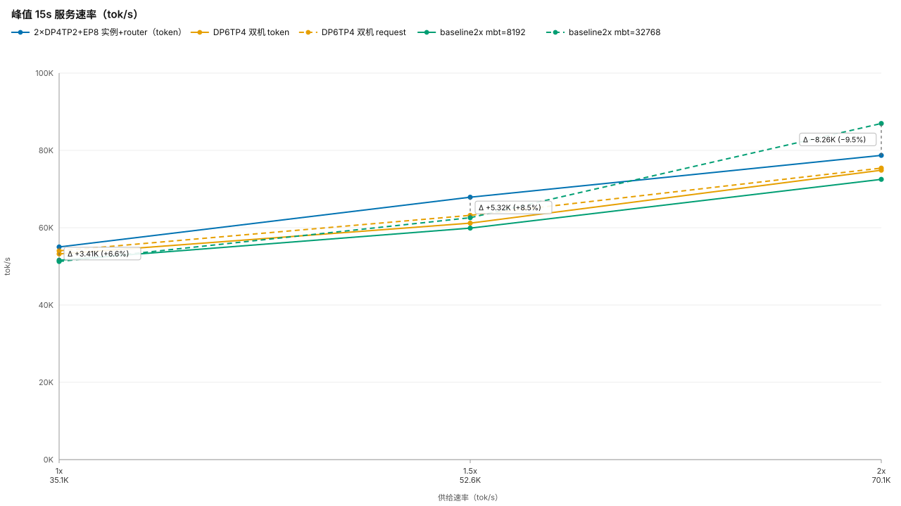
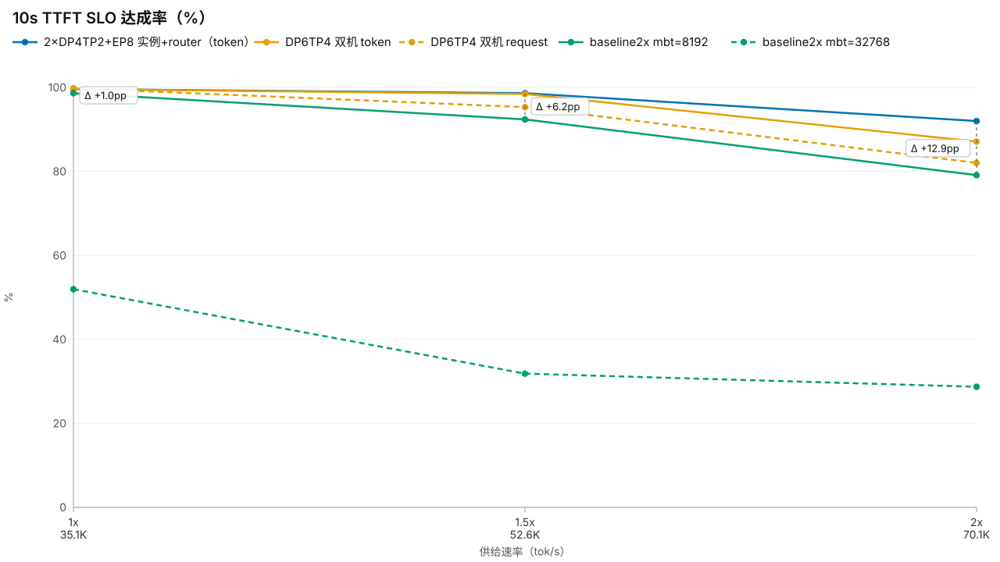

# AFD 性能实验报告（2026-09-04）

## 1. 拓扑说明

| 拓扑 | 卡数 | 含义 |
|---|---|---|
| baseline DP4TP4EP16 | 16 | 原生 vLLM（无 AFD）：4 个 DP 引擎 × TP4，MoE 专家 EP16 铺满 16 卡，attention 与 MoE 共卡 |
| baseline DP8TP2EP16 | 16 | 同上，8 引擎 × TP2（更多引擎、更窄 TP） |
| AFD DP4TP2 + DP8EP8 | 16 | **AFD 解耦**：NPU0-7 跑 attention（DP4×TP2，4 引擎），NPU8-15 跑 FFN（DP8，EP8，TP1），两侧经 CAM 异步 dispatch/combine |
| AFD DP6TP4 + DP8EP8 | 32（双机） | attention DP6×TP4 共 24 rank 跨两机 + FFN DP8EP8（第二机 8 卡） |
| AFD DP3TP8 + DP8EP8 | 32（双机） | attention 换成 DP3×TP8（更宽 TP、更少引擎） |
| **2× AFD DP4TP2 实例** | 32（双机） | **两个独立 16 卡 AFD 实例**（token-split，各含 DP4TP2 attention + DP8EP8 FFN），least_load_router 按各实例 waiting+running 队列做实例间均衡 |

负载统一为 formal_1（512 请求，长 prefill：p50=6.6K / p99=48K / max=63.8K tokens），
速率档 0.5x~1.5x（单机）与 1x/1.5x/2x（双机/双实例）；统一 async-sched ON、CWS、util 0.80。

## 2. 软件版本（三仓库提交）

| 仓库 | 提交 |
|---|---|
| vllm | `568afb3`（v0.26.0） |
| vllm-ascend | `e19e14da7`（基线 80d8c194f + compressor-tail workspace 复用补丁，即 CWS） |
| afd-plugin | 远程分支 `5252e54`（与本地质检版性能等价） |

## 3. 摘要：最重要的性能提升

- **单机 16 卡，AFD（DP4TP2+DP8EP8, mbt=65536）vs 逐点最优 baseline**（async ON;每个速率点取
  mbt 8192/32768 中更优者，与图中竖虚线标注同口径）：
  - 有效吞吐 **1x +4.8%、1.25x +6.6%、1.5x +8.6%**（1.5x：40,096 vs 36,925 tok/s）；
  - **TTFT p99 @1x −22.1%**（15.6 vs 20.0s，该点最优为 8192 档），p50 −37.4%（4.7 vs 7.4s）；
  - **10s TTFT SLO 达成率 @1x 85.2% vs 65.2%（+20.0pp）**（32768 档为 34.0%，差距 +51.2pp）。
- **双机 32 卡**：DP6TP4 AFD（token-split）对逐点最优 baseline2x **2x 有效吞吐 +6.8%**（61.6K vs 57.7K，该点最优为 8192 档）。
- **实例级扩展（2×16 卡 AFD 实例 + router）**：2x 有效吞吐 **62,993 tok/s**——对 DP6TP4-token
  **+2.2%**、DP6TP4-request **+7.0%**、**逐点最优 baseline2x +9.2%**（各点最优均为 8192 档：
  1x/1.5x/2x 分别 +2.0%/+4.3%/+9.2%；32768 档 +16.4%）；
  2x TTFT p50 对 DP6TP4 **−34%**（4.17 vs 6.31s）、对逐点最优 baseline2x −30.1%；10s SLO 对
  逐点最优 baseline **+12.9pp**。router 分流实测 766:772，无限流损耗。
- 负面对照：DP3TP8 布局 2x 吞吐 −22.5%（引擎数减半的排队代价）；DP8TP2 baseline 装不下
  mbt=32768（运行时 NPU OOM）。

> 关于 AFD 的 DP 数量：当前 attention DP 数是按现有 FFN 侧能力配平的选择。随着后续 FFN 侧
> 的进一步优化，该配置可能会有更新，但结果一定会比现在更优。

## 4. 单机 16 卡：AFD vs baseline

### 4.1 TTFT p50

次满载域（0.5x/0.75x）AFD 两条线贴地运行（2.5~3.3s），baseline-32k 起步就是 8.8s——
mbt=65536 单 chunk prefill 是 p50 优势的主要来源。baseline-8k 低速率贴着 AFD，但 1x 后
发散。差距标注（竖虚线，对"该点最优 baseline"即 8k）在 **1x 处 −2.8s（−37.4%）**，
1.25x 绝对差最大（−4.5s）。

### 4.2 TTFT p99

AFD token-split 的 p99 从 9.0s 缓慢爬到 34.3s。对逐点最优 baseline（低速率 8k、1.25x 起
32k）差距稳定在 **−19%~−22%**（1x 处 15.6 vs 20.0s）。低速率下 ~10s 尾是 63K 长 prompt
单请求的固有 prefill 延迟，非排队——AFD 把排队分量压到了固有值附近。

### 4.3 有效吞吐

次满载档四条线重合（都跟供给走）；**1x 之后分层**：AFD token 最高（对逐点最优 baseline
1x **+4.8%** → 1.5x **+8.6%**），baseline-8k 唯一往下掉（1.5x 只有供给的 59%）。AFD 的
持续容量 ≈38–40K、baseline ≈37K（16 卡）。

### 4.4 峰值 15s 服务速率

对逐点最优 baseline，峰值桶 0.5x–1x 落后 1~5%，1.25x 起反超 **+2.7~3.0%**：baseline 靠
堆 chunk 冲峰（32k 档 1.5x 峰值 45.4K），AFD 的 ubatch 流水把输出抹平。**AFD 的赢面在
持续速率和 TTFT 尾，不在爆发**。

### 4.5 10s TTFT SLO 达成率

分离度最大的一张：1x 处 **AFD 85.2% vs 逐点最优 baseline（8192 档）65.2%，+20.0pp**
（若对 32768 档则 34.0%、+51.2pp——8k 靠窄 mbt 在低速率保住 SLO，0.75x 后自由落体）。
超载档差距收敛到 +6.6~+7.8pp（1.25x：44.3% vs 37.7%）。

## 5. 实例级扩展：2×16 卡 AFD 实例 vs 双机

### 5.1 TTFT p50

2×实例的 p50 全程最低（2x 处 4.17s）：请求被 router 分到空闲实例，队列深度减半。
对最优 baseline2x 的差距在 1.5x 达到 **−1.38s（−33.1%）**。

### 5.2 TTFT p99

2x 处 2×实例 13.2s，对 DP6TP4-token（14.3s）−7.6%、对 baseline2x-8k（16.2s）−18.4%。
双机单实例在 2x 已开始排队上尾，双实例把尾压得更平。

### 5.3 有效吞吐

1x/1.5x 各方案在供给线附近重合（供给受限）；**2x 满负荷分层**：2×实例 **63.0K** >
DP6TP4-token 61.6K（+2.2%）> DP6TP4-request 58.9K（+7.0%）> baseline2x。对逐点最优
baseline2x（各速率点均为 8192 档）**1x +2.0%、1.5x +4.3%、2x +9.2%**（32768 档 2x 为
+16.4%）。两个 16 卡小实例 + 实例间均衡 ≥ 一个 32 卡双机实例——且 router 分流
766:772 几乎完美，无代理损耗。

### 5.4 峰值 15s 服务速率

峰值桶不是 AFD 的优势项：1x/1.5x 2×实例领先最优 baseline2x（**+6.6%/+8.5%**），但 2x
被 baseline2x-32k 的堆 chunk 爆发反超（86,970 vs 78,714，**−9.5%**）——与单机结论一致，
baseline 的峰值靠瞬时堆 chunk 冲出来，AFD 赢的是持续速率和 TTFT，不是爆发。

### 5.5 10s TTFT SLO 达成率

2x 处 2×实例 **92.0%**，对 DP6TP4-token 87.1%（+4.9pp）、对 baseline2x-8k 79.1%
（+12.9pp）。满负荷下每 10 个请求多 1 个以上保住 10s 首字。

## 6. 附：同日其他拓扑对照

- **DP3TP8+DP8EP8（双机 32 卡）**：1x 吞吐与 DP6TP4 打平但 TTFT p99 已 4×（32.8 vs
  8.2s）；1.5x eff −11%、**2x −22.5%**（45.6K vs 58.9K），drain 40.3s vs 14.4s。
  TP8 的宽度补不回引擎数减半——DP 值大的布局严格占优。
- **DP8TP2 baseline（单机 16 卡）**：次满载域比 DP4TP4 差 1.5~6%、TTFT 尾近翻倍；
  mbt=32768 运行时 NPU OOM（TP2 每卡权重翻倍），记为容量结论。
- KV 容量参考（每副本 @70K 请求）：AFD DP4TP2=464,378 tok（6.63×）；baseline
  DP4TP4 mbt32768=489,416（6.99×）、mbt8192=1,554,109（22.2×）——8k 的 KV 冗余证明
  它卡在调度而非容量。

## 7. 复算

- 数据：`bench_results/dsv4_afd_flash_xnode32/{dp4tp2_single_sweeps,dp4tp2_singlenode,
  singlenode2x,dp3tp8,async_sched,baseline1x}/`
- 图：HTML `line_charts_20260904.html` / `line_charts_2instances_vs_dp6tp4.html`
  （悬停交互 + 差距标注）；SVG 本目录引用的 `svg_20260904/*.svg`
- 工具：`tools/benchmarks/{singlenode_rate_lines_html,twoinstance_lines_html,
  export_rate_lines_svg}.py`、`tools/itask/bucket15_summary.py`
